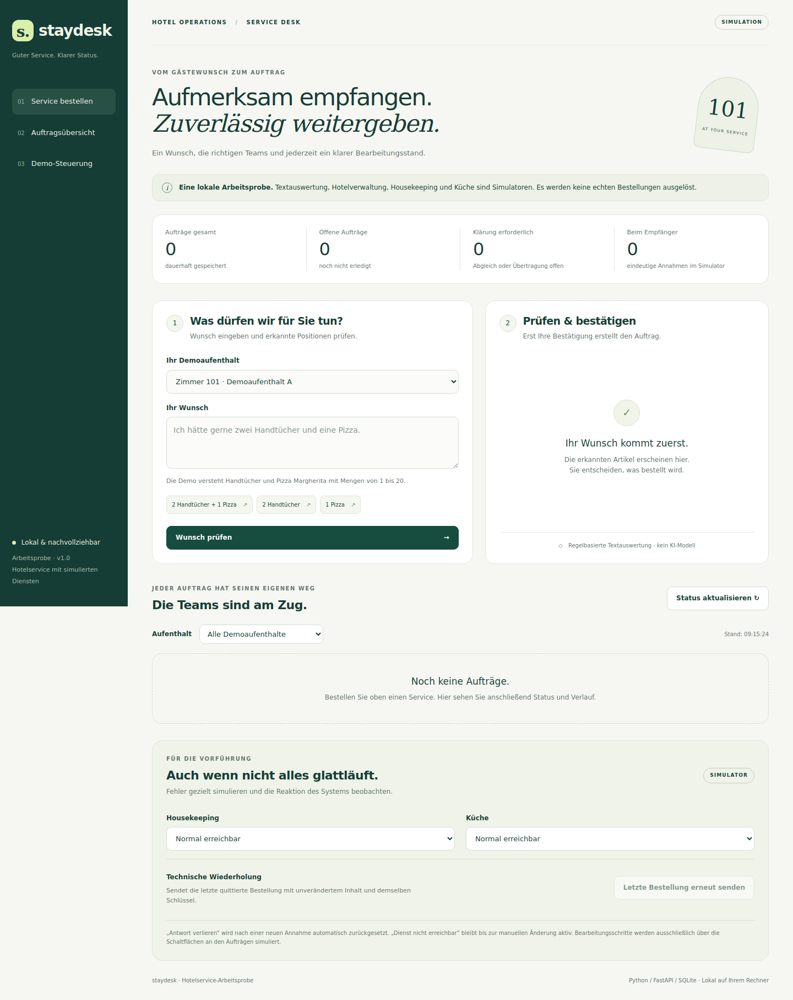

# Staydesk · Hotelservice-Prototyp

Lokale Arbeitsprobe: **„Zwei Handtücher und eine Pizza“** wird nach Bestätigung zu
zwei getrennten Aufträgen für Housekeeping und Küche. Dauerhafte Speicherung,
Schutz vor Doppelaufträgen, nachvollziehbarer Verlauf und demonstrierbare Fehlerfälle.

**Alle Dienste und die Textauswertung sind Simulatoren.** Kein echtes Sprachmodell,
keine echten Gäste, keine Bestellungen an ein Hotel, keine Zahlungen. Nach der
Installation arbeitet die Anwendung ohne Internet und ohne API-Schlüssel.



## Windows: ein Doppelklick

1. Python **3.11–3.14** installieren (empfohlen **3.12**, Option „Add python.exe to PATH“).
2. Diesen Branch herunterladen und die ZIP **vollständig entpacken**, oder klonen:

   ```bat
   git clone --branch feature/hotelservice-prototype https://github.com/FlorianS2908/ToeschPrototyp.git
   cd ToeschPrototyp
   ```

3. **`Start.cmd` doppelklicken.** Keine Adminrechte erforderlich.

Das Skript prüft Python, erstellt `.venv`, installiert Laufzeit- und Testpakete,
führt `pip check` und alle Python-Tests mit isolierten Testdaten aus und startet bei
Erfolg die Anwendung. Der Browser öffnet sich nach erfolgreicher Serverantwort:
**http://127.0.0.1:8000**. Das CMD-Fenster offen lassen; Beenden mit **Strg+C**.
Bei einem Fehler bleibt das Fenster mit Erklärung offen.

Der erste Start benötigt Internet für Python-Pakete. Bereits installierte passende
Pakete werden wiederverwendet. Die CMD-Datei wurde hier statisch geprüft; ein nativer
Windows-Ausführungstest ist in der Linux-Prüfumgebung nicht möglich. Backend,
Startprogramm und Prüfschritte werden hier unter Linux ausgeführt.

## Manueller Start (Windows, Linux, macOS)

```bash
python -m venv .venv
# Windows CMD:
.venv\Scripts\activate
# Linux/macOS stattdessen: source .venv/bin/activate
python -m pip install -r requirements-dev.txt
python -m pip check
python -m pytest -q
python run.py
```

Reiner Laufzeitbetrieb benötigt nur `requirements.txt`. Für Entwicklungsprüfungen:
`python -m ruff check .` und `python -m ruff format --check .`.

Optionaler echter Browsertest (Node.js nur dafür erforderlich):
`npm install --no-save --package-lock=false playwright@1.51.1`, anschließend
`npx playwright install chromium` und `node tests/browser_smoke.cjs`. Er startet
einen eigenen Server mit temporären Daten, prüft den vollständigen Ablauf und
einen echten Prozessneustart und beendet ihn danach. Prüfbilder liegen in
`test-results/`. Für bereits vorhandene Testumgebungen sind `PLAYWRIGHT_MODULE`,
`CHROMIUM_EXECUTABLE` und `BROWSER_TEST_PYTHON` überschreibbar.

## In wenigen Schritten ausprobieren

1. Zimmer 101 auswählen, Beispiel „2 Handtücher + 1 Pizza“ anklicken, **Wunsch prüfen**.
2. Erkannte Positionen kontrollieren und **Verbindlich in der Demo bestellen** drücken.
3. Beide Aufträge erscheinen mit Menge, Empfänger, Referenz und Verlauf.
4. Unter „Demo-Steuerung“ **Letzte Bestellung erneut senden**: dieselben Aufträge,
   keine zusätzliche Annahme beim Empfänger.
5. Nochmals „2 Handtücher“ eingeben: offene Bestellung ansehen oder ausdrücklich
   die neuen Positionen zusätzlich bestellen.
6. Für einen frischen Aufenthalt Housekeeping auf **Nächste Annahme: Antwort verlieren**
   stellen und bestellen. Der Auftrag bleibt **Rückmeldung unklar**. **Abgleichen /
   erneut übermitteln** bestätigt den vorhandenen Empfängerauftrag ohne Duplikat.
7. „Simulator: Bearbeitung starten“ und „Simulator: Erledigen“ zeigen echte
   Statusänderungen **innerhalb des Simulators**. Es gibt keine automatische Fertigmeldung.

Ausführlicher fünfminütiger Ablauf: [docs/DEMO.md](docs/DEMO.md).

## Zustände verstehen

| Anzeige | Bedeutung |
|---|---|
| Gespeichert | Bestellung dauerhaft im Koordinator, Empfang noch nicht bestätigt. |
| Rückmeldung unklar | Übergabe begonnen; tatsächliche Annahme muss abgeglichen werden. |
| Übermittelt | Empfänger hat die Annahme bestätigt. |
| In Bearbeitung | Empfänger meldet laufende Bearbeitung. |
| Erledigt | Empfänger bestätigt Abschluss. |

„Status aktualisieren“ liest den im Koordinator gespeicherten Stand. **„Abgleichen /
erneut übermitteln“ fragt den Empfänger ab** und überträgt einen dort fehlenden
offenen Auftrag mit derselben Referenz erneut. Wiederholung derselben bestätigten
Gastanfrage ist lesend und zeigt aktuelle gespeicherte Aufträge. Kein automatischer
Retry-Worker: Wiederanlauf und Fehlerbehebung bleiben für die Vorführung manuell.

Die vier Kennzahlen zählen alle Demoaufenthalte; der darunterliegende Filter betrifft
nur die Auftragskarten. „Beim Empfänger“ liest für die Vorführung direkt die
Simulator-Daten: So ist die Differenz zwischen Annahme und verlorener Rückmeldung sichtbar.

## Unterstützte Eingaben

- `Ich hätte gerne zwei Handtücher und eine Pizza.`
- `2 Handtücher`, `Eine Pizza`, `Bitte 3 Handtücher, 2 Pizza Margherita`
- Zahlen 1–20 oder deutsche Zahlwörter eins–zehn; pro Artikel insgesamt höchstens 20.
- Gleiche Artikel werden zusammengezählt. Zusätze wie Salami, Zeiten, Negationen,
  unbekannte Artikel und fehlende Mengen werden **nicht still verworfen**:
  Die gesamte Bestellung benötigt dann eine erneute, unterstützte Eingabe.

Der Parser führt keinen freien Dialog und versteht keine beliebigen Formulierungen.
Die Rückfrage wird durch eine neue vollständige Eingabe beantwortet.

## Daten, Betrieb und Grenzen

`data/hotel.sqlite` speichert Anfragen, Aufträge und Ereignisse;
`data/recipients.sqlite` speichert Empfängerannahmen und Fehlermodi. Beide Datenbanken
überleben Neustarts. Im Browser wird die letzte bzw. noch nicht quittierte Sendung
pro Tab in `sessionStorage` aufbewahrt. Neuladen erhält diesen Zustand; Schließen
des Tabs kann ihn löschen. Vorhandene offene Aufträge sind weiterhin im Backend sichtbar.

- Server bindet nur an `127.0.0.1`. Kein öffentlicher Betrieb, keine Authentifizierung
  und keine Trennung von Gast- und Mitarbeiterrechten. Alle Ansichten dienen derselben lokalen Demo.
- Tests erzeugen ausschließlich temporäre Datenbanken. Sie verändern keine Demoaufträge.
- Für einen frischen Demostand Server beenden und den kompletten Ordner `data` umbenennen.
  Browser-Tab schließen und neu öffnen. Alte Daten bleiben im umbenannten Ordner erhalten.
- Beide Datenbanken gehören zusammen. Nur eine zurückzusetzen oder während des Betriebs
  einzelne SQLite-/WAL-Dateien zu kopieren ist kein unterstützter Wiederherstellungsweg.
- Bei Sicherungen Server beenden und den gesamten Datenordner sichern.
- Python-Protokolle sind Adapteranschlüsse. Reale APIs, Berechtigungen, Timeouts, Retry-Worker,
  Überwachung und sichere Zuordnung Gast ↔ Aufenthalt sind mögliche nächste Ausbauschritte.

Optionale Umgebungsvariablen: `HOTEL_DATA_DIR`, `HOTEL_PORT` (1024–65535, Standard 8000),
`HOTEL_NO_BROWSER=1`. In CMD beispielsweise vor `Start.cmd`: `set HOTEL_PORT=8001`.
Bei belegtem Port bricht der Start verständlich ab, ohne einen anderen Prozess zu beenden.

## Projekt und Prüfnachweise

| Datei / Verzeichnis | Zweck |
|---|---|
| `app/main.py` | FastAPI-Endpunkte, lokale Schutzmechanismen, Zusammenstellung der Adapter |
| `app/service.py` | Transaktionale Anlage, Duplikatprüfung, Abgleich und Ereignisse |
| `app/adapters.py` | PMS-/Empfänger-Ports, Simulatoren und Empfängeridempotenz |
| `app/interpreter.py` | Austauschbarer Interpretations-Port und strikter Regelparser |
| `app/db.py`, `app/models.py` | Datenbankschema und validierte Verträge |
| `app/static/` | Browseroberfläche, ohne externe Fonts, CDNs oder Frontend-Build |
| `tests/` | Funktion, Fehlerfälle, Parallelität, Neustart und Grenzen |
| `Start.cmd`, `run.py` | Installation, Prüflauf und lokaler Start |
| [docs/PLAN.md](docs/PLAN.md) | Analyse, Planreview und Kriterien A01–A15 |
| [docs/ARCHITECTURE.md](docs/ARCHITECTURE.md) | Garantien, Adaptervertrag und API |
| [docs/REVIEW.md](docs/REVIEW.md) | Zwei Reviewperspektiven, Korrekturen und Schlussurteil |

Maschinenlesbarer API-Vertrag: `/openapi.json`. Keine Swagger-CDN-Abhängigkeit.
Alle schreibenden API-Aufrufe benötigen JSON (`Content-Type: application/json`).
